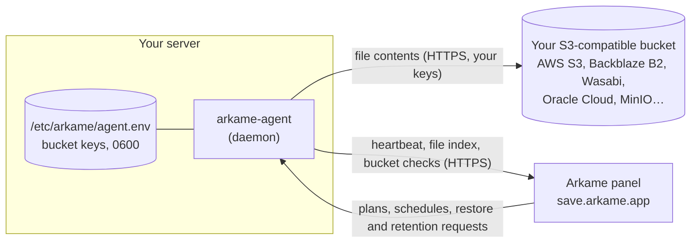

# Arkame Agent

[](LICENSE)
[](https://github.com/arkame-app/arkame-agent/releases/latest)
[](https://github.com/arkame-app/arkame-agent/actions/workflows/ci.yml)
[](#verify-releases-cosign)

The open source backup agent behind [Arkame](https://arkame.app/en?utm_source=github&utm_medium=readme&utm_campaign=agent-repo):
it backs up a server's folders straight to **your own** S3-compatible bucket,
with keys that never leave the server, and restores any version back.

It runs on Linux, macOS and Windows (amd64 and arm64). The Arkame panel
schedules the backups and indexes them; the files themselves go from your server
to your bucket and nowhere else.

> I'm the founder. This repository is the part of Arkame that runs on your
> machine, published so you can read exactly what it does before you run it as
> root. The agent is not a standalone tool: it needs an Arkame account to get
> its plans (see [Limitations](#limitations)).

**Documentation:** [English](https://arkame.app/en/docs?utm_source=github&utm_medium=readme&utm_campaign=agent-repo)
· [Português](https://arkame.app/docs?utm_source=github&utm_medium=readme&utm_campaign=agent-repo)
· [Español](https://arkame.app/es/docs?utm_source=github&utm_medium=readme&utm_campaign=agent-repo)

## Quickstart (Docker)

1. In the [Arkame panel](https://save.arkame.app/?utm_source=github&utm_medium=readme&utm_campaign=agent-repo),
   add your bucket and go to **Agents → New agent**. It shows this command with
   a one-time install code (`atk_…`, valid for 24 hours).
2. Run it on the server:

   ```bash
   sudo docker run --pull always --rm -it --user 0 --security-opt label=disable --hostname "$(hostname)" -v /etc/arkame:/etc/arkame \
     ghcr.io/arkame-app/arkame-agent:latest install --token=atk_... --panel-url=https://save.arkame.app --install-service=false \
   && { sudo docker stop -t 150 arkame-agent >/dev/null 2>&1; sudo docker rm arkame-agent >/dev/null 2>&1; \
     sudo docker run -d --name arkame-agent --restart always --stop-timeout 150 --user 0 --security-opt label=disable --hostname "$(hostname)" \
     -v /:/host -v /etc/arkame:/etc/arkame ghcr.io/arkame-app/arkame-agent:latest; }
   ```

   The first container asks for your bucket's access key and secret, **tests
   them against the bucket**, registers the server and waits for you to approve
   it in the panel. Only if that succeeds is the old container (if any) replaced
   and the service started.
3. Approve the server in the panel and create a backup plan.

Why the flags:

- `--pull always`: the agent does not update itself. Re-running this command is
  how you update it on Docker; without the flag Docker reuses the `:latest`
  image already on the host.
- `--stop-timeout 150` / `stop -t 150`: a stopping agent may need up to 150 s
  to finish the upload in progress and send the backup's index to the panel.
  Docker's default 10 s (or `docker rm -f`) kills it first and that restore
  point is lost.
- `-v /:/host` (read-write): the agent reads the folders you back up, and
  restores write back to the server, including to the original location.
- `--security-opt label=disable`: on SELinux hosts (RHEL, Rocky, Fedora) the
  container otherwise cannot read the host or write `/etc/arkame`. Elsewhere it
  does nothing.

## How it works



```
┌──────────── your server ────────────┐
│  arkame-agent                        │  file contents   ┌───────────────────┐
│   • walks the folders in the plan    │ ───────────────► │ your bucket        │
│   • SHA-256 per file, skips unchanged│   your keys      │ (versioned)        │
│   • uploads (multipart for big files)│                  └───────────────────┘
│   • restores with atomic writes      │
│                                      │  index + status  ┌───────────────────┐
│   keys stay in /etc/arkame (0600)    │ ◄──────────────► │ Arkame panel       │
└──────────────────────────────────────┘  plans, restores └───────────────────┘
```

- **Enrollment.** `install` generates an Ed25519 key pair on the server and
  registers it with the one-time code. Nothing runs until you approve that
  server in the panel; the agent then gets a bearer token (renewed by the panel
  before it expires) for its calls.
- **Backups.** The agent polls the panel for plans (every 60 s by default) and
  runs them within the configured schedule, time windows and bandwidth limit.
  It hashes each file with SHA-256, checks the bucket (`HeadObject`) to skip
  unchanged content, uploads the rest straight to your bucket, and then sends
  the session's file index to the panel.
- **Versions live in your bucket.** Point-in-time restore relies on the bucket's
  own object versioning; the agent periodically reports whether versioning,
  Object Lock and lifecycle rules are set so the panel can warn you.
- **Restores.** You pick files in the panel (search, folder browser or
  timeline). The agent downloads that exact version from your bucket, writes it
  atomically, and checks the SHA-256 before reporting success. Objects in cold
  storage (Glacier, Deep Archive) are rehydrated first.
- **Retention.** Old versions are deleted by the agent, with your keys, from a
  list the panel authorizes. The agent refuses to delete the current version of
  a file as part of version thinning.

## What the panel can and cannot see

The panel never receives your bucket keys and never receives file contents.
This is what the agent does send to the panel (`internal/api/types.go` and
`internal/daemon/daemon.go` have the exact payloads):

| Sent to the panel | When |
|---|---|
| Server name (hostname), OS and architecture, agent version, install method (Docker or binary), Ed25519 public key | Enrollment |
| Agent version, OS, service name and scope, path of the agent program | Heartbeat (every 60 s) |
| Your server's IP address | Implicitly, on every request |
| Bucket check results: versioning, Object Lock and lifecycle settings, total bytes and object count in the bucket, access errors | Hourly, and when you click "Test connection" |
| Per-backup file index: object key (the file's path), size, modification time, SHA-256 and the bucket's version ID; plus counters (files, bytes) | End of each backup |
| Up to 8 KB of output from a plan's pre/post-backup command | When that command fails |
| Error messages from failed backups, files and restores | When something fails |
| Names of folders and files, and file sizes, in a folder you open | When you browse folders while creating a plan |
| Restore progress, and the keys/version IDs deleted by retention | During restores and retention runs |

Never sent: the bucket access key and secret, file contents, the agent's
private key.

The panel is the control plane, so be clear about what it can **ask** the agent
to do:

- back up any folder the agent can read, and list folders when you browse;
- restore files from your bucket to any path the agent can write
  (with "overwrite" as one of the conflict options);
- delete non-current versions in your bucket for retention;
- run the pre/post-backup shell commands you set on a plan (for example
  `pg_dump`), as the user the agent runs as (root or SYSTEM for a system
  service). These do not run in the Docker install.

If you want a hard limit on what a compromised panel account could reach, run
the agent with less privilege: the native installer without `sudo` installs a
user service that reads only what that user can read, and bucket credentials
limited to a single bucket keep it away from the rest of your account. Object
Lock in compliance mode keeps versions from being deleted before their retention
date by anyone, the agent included.

The [privacy policy](https://arkame.app/en/privacidade?utm_source=github&utm_medium=readme&utm_campaign=agent-repo)
(section 3) describes the same data from the legal side.

## Verify releases (cosign)

Every release is built by GitHub Actions from a tag in this repository, after
the test suite passes. `checksums.txt` covers every archive and binary, and is
signed keyless with [Sigstore cosign](https://docs.sigstore.dev/) through the
workflow's GitHub OIDC identity, so there is no long-lived signing key.

```bash
VERSION=v0.4.31   # pick a release
gh release download "$VERSION" -R arkame-app/arkame-agent \
  -p 'checksums.txt*' -p 'arkame-agent_linux_amd64.tar.gz'

cosign verify-blob checksums.txt \
  --signature checksums.txt.sig \
  --certificate checksums.txt.pem \
  --certificate-identity-regexp '^https://github\.com/arkame-app/arkame-agent/\.github/workflows/release\.yml@refs/tags/v' \
  --certificate-oidc-issuer https://token.actions.githubusercontent.com

sha256sum --ignore-missing -c checksums.txt
```

The installers (`install.sh`, `install.ps1` and the Windows `setup` command)
check the downloaded package against `checksums.txt` and stop without
installing anything on a mismatch, or if the checksum file cannot be fetched.
They check the SHA-256 only; they do not run cosign.

## Native install (Linux, macOS, Windows)

Each command comes from the panel with your install code. As with Docker, it
asks for the bucket key, tests it, registers the server, waits for approval and
then installs the service (systemd, launchd or a Windows service).

**Linux and macOS**

```bash
curl -fsSL https://get.arkame.app/install.sh | sudo sh -s -- --token=atk_...
```

Without `sudo`, the agent is installed for your user only (a user service)
and reads only what you can read. Useful options: `--version=vX.Y.Z`,
`--service-name` and `--config` (one agent per bucket credential),
`--no-service`. For the full list:
`curl -fsSL https://get.arkame.app/install.sh | sh -s -- --help`.

**Windows** (Windows + R, paste, Enter)

```text
cmd /c "curl -fsSLo "%TEMP%\arkame-agent.exe" https://get.arkame.app/agente.exe && "%TEMP%\arkame-agent.exe" setup --token=atk_... || pause"
```

`setup` asks for administrator rights, checks its own SHA-256 against the
release's `checksums.txt`, copies itself to `C:\Program Files\Arkame` and runs
`install`. `curl.exe` ships with Windows 10 (1803+), 11 and Server 2019+; on
Server 2016 use `install.ps1` from an elevated PowerShell.

**Manual download.** Archives and plain binaries for every platform are on the
[releases page](https://github.com/arkame-app/arkame-agent/releases); the
container image is `ghcr.io/arkame-app/arkame-agent`.

### Day-to-day commands

```bash
sudo /usr/local/bin/arkame-agent status                       # identity, key fingerprint, enrollment state
sudo /usr/local/bin/arkame-agent check-storage                # test the bucket key in the config file
sudo /usr/local/bin/arkame-agent set-storage-keys --restart   # replace the key: asks, tests, saves, restarts
sudo /usr/local/bin/arkame-agent uninstall                    # removes service, config, identity and program

# Installed as root where /usr/local/bin is not root-only (Homebrew on an
# Intel Mac; the installer says so): the program is in /opt/arkame/bin
sudo /opt/arkame/bin/arkame-agent status
sudo /opt/arkame/bin/arkame-agent check-storage
sudo /opt/arkame/bin/arkame-agent set-storage-keys --restart
sudo /opt/arkame/bin/arkame-agent uninstall

# Installed without root (Linux or macOS): no sudo
~/.local/bin/arkame-agent status
~/.local/bin/arkame-agent check-storage --service-scope user
~/.local/bin/arkame-agent set-storage-keys --restart --service-scope user
~/.local/bin/arkame-agent uninstall --service-scope user
```

Docker: `sudo docker logs --tail 50 arkame-agent`, and always restart or stop
with `-t 150`. Removing the agent leaves your backups in the bucket.

### Configuration

The agent reads `/etc/arkame/agent.env` (`C:\etc\arkame\agent.env` on Windows;
`~/.config/arkame/agent.env` for a user install), readable by root/Administrators
only. Process environment variables override the file.

| Variable | Purpose |
|---|---|
| `STORAGE_ACCESS_KEY`, `STORAGE_SECRET_KEY` | Bucket credentials. Used only to talk to the bucket. |
| `STORAGE_BUCKET`, `STORAGE_REGION`, `STORAGE_ENDPOINT` | Bucket name, region (default `us-east-1`), endpoint for non-AWS providers |
| `STORAGE_ID` | Storage ID in the panel |
| `PANEL_URL` | Default `https://save.arkame.app` |
| `HOST_ROOT` | `/` natively, `/host` in Docker |
| `POLL_INTERVAL_SEC`, `HEARTBEAT_INTERVAL_SEC` | Plan/restore polling and heartbeat intervals (default 60) |
| `TOKEN_PATH`, `PRIVATE_KEY_PATH`, `AGENT_ID_PATH`, `AGENT_ID` | Agent identity files (written at enrollment) |
| `SIBLING_BUCKETS` | Buckets served by other agent processes on the same host |
| `HTTPS_PROXY`, `NO_PROXY` | Standard proxy variables, honored for panel calls |

The complete reference (multiple agents per host, re-enrollment, macOS Full Disk
Access, OneDrive, permission checks on the service binary) is in the
[Portuguese usage guide](docs/USAGE.pt-BR.md) and on
[arkame.app/en/docs](https://arkame.app/en/docs?utm_source=github&utm_medium=readme&utm_campaign=agent-repo).

## Limitations

Things you should know before relying on it:

- **It needs the Arkame panel.** Plans, schedules, restores and retention are
  driven by the panel; the agent alone does not back anything up. If the panel
  is unreachable, scheduled backups do not start, but everything already
  uploaded stays in your bucket, readable with any S3 tool. Arkame is a paid
  service (14-day free trial, no card required).
- **No client-side encryption.** Files are stored in your bucket as they are on
  disk. Use your provider's server-side encryption and keep the bucket private.
- **No self-update.** Re-run the install command to update (Docker:
  `--pull always` takes care of fetching the new image).
- **Windows binaries are not code-signed yet.** Windows 11 with Smart App
  Control turned on blocks the agent; Windows 10 and Windows Server work.
  Integrity is covered by the cosign-signed checksums.
- **The container image is not signed** with cosign; only `checksums.txt` is.
- **No filesystem snapshots** (LVM, VSS, btrfs). Files are read as they are;
  for databases, dump to a folder first (a plan's pre-backup command natively,
  or a host cron job with Docker, where pre/post commands do not run).
- **Native Linux service restores** into `/etc`, `/usr` or `/boot` fail because
  the systemd unit uses `ProtectSystem=full`; restore elsewhere and copy. The
  Docker install can write there.
- **Docker on host reboot:** the 150 s stop timeout applies to `docker stop` and
  `docker restart`, but on a reboot `docker.service`'s own stop timeout wins
  (often 90 s). Use the native agent, or raise `TimeoutStopSec` for
  `docker.service`, if a backup must close cleanly on reboot.
- **Bucket providers:** any S3-compatible service with versioning. Cloudflare R2
  is not accepted for new storage in the panel, since it has neither versioning
  nor Object Lock.
- **Cloud-only OneDrive files are skipped** on Windows (reading them would
  download the whole OneDrive). On macOS the service needs Full Disk Access to
  read Desktop, Documents, Downloads and iCloud Drive.
- **CLI messages and logs are in Brazilian Portuguese** for now.

## Building from source

```bash
make build        # bin/arkame-agent for this platform
make build-all    # cross-compile: linux, darwin, windows; amd64 and arm64
make test         # go test -race with coverage
```

Go 1.25+. Code layout, architecture notes and the development backlog are in
[docs/DEVELOPMENT.md](docs/DEVELOPMENT.md) (Portuguese).

## Contributing and security

Issues and pull requests are welcome; see [CONTRIBUTING.md](CONTRIBUTING.md).
Please report vulnerabilities privately as described in
[SECURITY.md](SECURITY.md), not in public issues. This project follows the
[Contributor Covenant](CODE_OF_CONDUCT.md).

| Role | Members |
|---|---|
| Committers and reviewers | [hugolf](https://github.com/hugolf) |
| Approvers | [hugolf](https://github.com/hugolf) |

## License

[Apache License 2.0](LICENSE).
